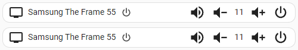

# home-assistant-tv-card
An example of a simple tv card for home assistant with JavaScript and Lit-Element. A great start for any custom UI card.



The card support the visual Editor.

## Create a custom card manually

1. Upload (or create) one of the files in the the `CONFIG` folder under `www`.
   
   Example: CONFIG/www/local/simple-media-player-card.js

   NOTE: The `www` folder may be missing. If this is the case create it and restart home assistant. Also, You can create/upload the file directly under `www` or create any number of sub-folders.

1. Go to `Settings` -> `Dashboards` -> options (the 3 dots menu) -> Resources or navigate to `/config/lovelace/resources`.
1. `Add Resource` of type `JavaScript module` with url `local/path-to-js-file?v=1` (e.g. `local/local/simple-media-player-card.js?v=1`).
  
   The suffix `?v=1` is used to refresh the cache when the `js` files changes. If you do any changes to the source code you need to go again to resources and change the version `?v=2`, `?v=3`, etc.

1. Go to a dashboard and try the new card.

### simple-media-player-extended

**example configs**

```yaml
type: custom:simple-media-player-card2
entity: media_player.samsung_the_frame_55
title: Samsung TV
customKeys:
  - icon: mdi:power-cycle
    title: power button
    type: command
    value: KEY_POWER
  - icon: mdi:netflix
    title: Netflix
    type: app
    value: org.tizen.netflixapp
  - icon: mdi:youtube
    title: YouTube
    type: app
    value: 111299001912
  - icon: mdi:video
    title: Prime Video
    type: app
    value: org.tizen.primevideo
  - icon: mdi:home
    title: Netflix
    type: command
    value: KEY_HOME
```

| type | command |
| ---------------- | ------- |
| app | `media_player.media_play` media_content_type: `app` media_content_id: `value` | 
| key | `media_player.play_media` media_content_type: `send_key` media_content_id: `value` |
| source | `media_player.select_source` source: `value` |
| custom | `media_player.play_media` media_content_type: `value.split\('\|')[0]` media_content_id: `value.split\('\|')[1]` |
| command | `remote.send_command` command: `value` |
