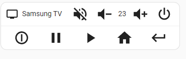

# home-assistant-tv-card
An example of a simple tv card for home assistant with JavaScript and Lit-Element. A great start for any custom UI card.




The card support the visual Editor.

## Create a custom card manually

1. Upload (or create) one of the files in the the `CONFIG` folder under `www`.
   
   Example: CONFIG/www/local/simple-media-player-card.js

   NOTE: The `www` folder may be missing. If this is the case create it and restart home assistant. Also, You can create/upload the file directly under `www` or create any number of sub-folders.

1. Go to `Settings` -> `Dashboards` -> options (the 3 dots menu) -> Resources or navigate to `/config/lovelace/resources`.
1. `Add Resource` of type `JavaScript module` with url `local/path-to-js-file?v=1` (e.g. `local/local/simple-media-player-card.js?v=1`).
  
   The suffix `?v=1` is used to refresh the cache when the `js` files changes. If you do any changes to the source code you need to go again to resources and change the version `?v=2`, `?v=3`, etc.

1. Go to a dashboard and try the new card.

### simple-media-player-extended

**example configs**

```yaml
entity: media_player.samsung_the_frame
type: custom:simple-media-player-card2
title: Samsung TV
bars:
  - align: evenly
    items:
      - icon: mdi:power-cycle
        iconOff: mdi:circle-outline
        iconExpression: attributes.art_mode_status==off
        title: Power
        type: command
        value: KEY_POWER
      - icon: mdi:pause
        title: Pause
        type: command
        value: KEY_PAUSE
        disabled: attributes.art_mode_status==off
      - icon: mdi:play
        title: Play
        type: command
        value: KEY_PLAY
        disabled: attributes.art_mode_status==off
      - icon: mdi:home
        title: Home
        type: command
        value: KEY_HOME
      - icon: mdi:keyboard-return
        title: Home
        type: command
        value: KEY_RETURN
  - align: evenly
    items:
      - icon: mdi:epsilon
        title: EON
        type: app
        value: IaJ5S3D7jQ.eon
      - icon: mdi:netflix
        title: Netflix
        type: app
        value: org.tizen.netflix-app
      - icon: mdi:video
        title: Prime Video
        type: app
        value: org.tizen.primevideo
      - icon: mdi:diamond-outline
        title: Prime Video
        type: app
        value: MCmYXNxgcu.DisneyPlus
      - icon: mdi:shield-account-outline
        title: Sky
        type: app
        value: skysh0WTIM.SkyShowtime
```

#### Configuration

##### Config
| | |
| - | - |
| entity | The entity name |
| title | The title on the card |
| bars | a list of [bar](#bar) |
| - align | `evenly`,`between`, or empty for left alignment |
| - items | a list of items/actions |

##### Bar

| | |
| - | - |
| align | `evenly`,`between`, or empty for left alignment |
| items | a list of [Items/Actions](#item) |

### Item

| | |
| - | - |
| icon | the material icon |
| iconOff | (optional) shows instead of `icon` when `iconExpression` is false |
| iconExpression | (optional) when defined determine `icon` or `iconOff` is shown (see [expression](#expression)) |
| hideTitle | (optional) when `true` it hide the title |
| title | item title |
| type | (optional) `app`, `key`, `source`, `command`, `custom` (see [Action Types](#action-types)). If not provided, no action will execute. |
| value | the action value |
| disabled | (optional) expression determines when to disabled the action (see [expression](#expression)) |

##### Action Types

> type: key \
> service: media_player.play_media \
> media_content_type: send_key \
> media_content_id: &value

> type: app \
> service: media_player.play_media \
> media_content_type: app \
> media_content_id: &value

> type: source \
> service: media_player.select_source \
> source: &value

> type: command \
> service: remote.send_command \
> command: &value

> type: custom \
> service: media_player.play_media \
> media_content_type: &value.split(.)[0] \
> media_content_id: &value.split(.)[1]
>
> _note: value is `{context_type}.{context_id}`_

# Expression

The expression is of type `{attribute_name}=={value}`.
examples: \
`source == TV` \
`source != TV`
`source ~= HDMI`
`sources *= TV`

| operand | info |
| - | - |
| == | equals |
| != | not equals |
| ^= | starts with |
| $= | ends with |
| *= | included in array |
